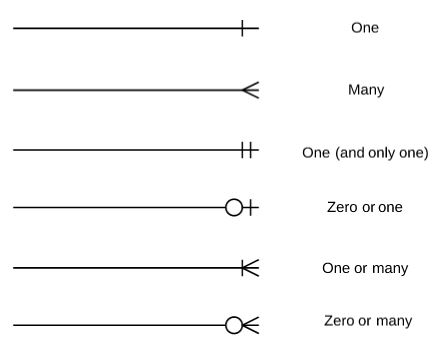

# XanthiaMason_T2A2

## GitHub Repository
The link to the GitHub repository for this project can be found [here](https://github.com/xanni99/XanthiaMason_T2A2).

## R1: Problems the App Solves:

The app being developed is a ‘Friend Library’ that will allow friends and/or family to make their own library where they can each add all of the books that they own (and are willing to share) and allow everyone else in the group to borrow their books and likewise allow them to borrow the books from other members of the group. In addition to this, it provides a space where books read by friends/family can be reviewed.

The development of this app aims to solve many problems that avid book lovers are currently facing, including difficulty tracking loans amongst friends/family, the cost of living crisis and underutilised book collections (sustainability)

Firstly, when friends or family borrow books, it is easy to lose track of who borrowed what and when, ultimately leading to lost or forgotten books. Additionally, friends that have borrowed a book may have forgotten who it came from, making it awkward for the lender to try and get the book back. The ‘Friend Library’ will provide a structured way to manage the lending and borrowing of books amongst friends/family. Users can request to borrow a book through the app, and the system keeps track of who has borrowed which book and for how long. Users can request how long they would like to borrow the book for, and be given a due date for when the book needs to be returned. Ultimately the app will help ensure borrowed books are returned to the user who owns the book in a timely manner. 

Secondly, the cost of living crisis has meant that “40% of Australian households have struggled to afford household basics in the last three months, and over half of Australians say they will struggle to pay an essential bill over the next three months” (The Salvation Army Australia, 2023). As a result, the cost of living crisis reduces disposable income, making it harder for people to purchase new books. ‘The Friend Library’ provides a cost-effective solution for a group of friends to access a wide range of books, promoting reading and literacy even during economically challenging times. 

Finally, sustainability is a crucial consideration in today's world, particularly regarding the production and consumption of goods. A study by the Pew Research Center found that while the average American reads 12 books per year, a significant portion of personal book collections remain underutilised after initial reading (Perrin, 2016). The ‘Friend Library’ app addresses sustainability concerns by promoting the sharing of books, reducing the need for new purchases, and ultimately minimising environmental impact. 

## R2: Allocation and Tracking of Tasks:

Throughout the length of this project, Trello was used as a project management tool in order to help me allocate and keep track of the tasks required. For this project, I ordered my Trello board into 4 lists, and used labels and due dates to identify the importance/priority of each card. 

The colour key for the labels can be found below:

**Initial Trello Board:**

Firstly, I had a Project ‘Overview’ List, which broke the project down into the 6 broad steps that had to be taken in order to submit a complete assignment. By doing this, I was able to establish a timeline using the ‘due date’ feature provided by Trello which gave me an idea of when each step should be completed by. I chose to implement the due dates on the broader steps rather than giving each and every task a due date as not only was this more time efficient, I was unsure of how long each little card (within the other lists) would take.

The other 3 lists included a more specific breakdown tasks. For more complex tasks I further broke these down through the use of Trello’s ‘Checklist’ feature which allowed me to create more manageable mini tasks. Ultimately, this allowed me to more specifically keep track of what task I was up to. Although the majority of these cards/tasks were planned at the beginning of the project, some additional cards and/or checklist items were added as a greater understanding of the project requirements became clear. 

An example of a card with a checklist can be seen below:

Below are a few progress screenshots throughout the length of the project. The full history of the Trello board can be accessed using this [link](https://trello.com/invite/b/9WrdjPWe/ATTIcecca4744731527ce26eaddc016749955A1825ED/t2a2-api-webserver).

**Trello Board at Halfway (22/06/24):**

**Trello Board at End of Project (30/06/24):**

In addition to using Trello for overall project management, GitHub was utilised for version control and code management. With over 40 commits, GitHub provided an efficient way to store, track and manage changes to the code throughout the project.

## R3: Third-Party Services, Packages and Dependencies:

| **Packages**     | **Description** |
| ------------ | ------------------------------------------ |
| Flask        | **Flask** is a micro web framework written in python. Flask serves as the core framework of the application, handling routing, request processing, and responses. It provides the essential tools needed to build web applications and APIs.|
|| **Flask-JWT-Extended**: This is an extension for Flask that simplifies the integration of JSON Web Tokens (JWT) for authentication and authorization.This extension manages the creation, handling, and verification of JWTs. It helps secure the application by ensuring that only authenticated users can access certain endpoints.
| PostgreSQL   | **PostgreSQL** is an open-source, powerful, and highly extensible relational database management system (RDBMS). PostgreSQL serves as the database backend for the application, storing all persistent data including user information, application state, and other critical data. |
| SQLAlchemy   | **SQLAlchemy** is a SQL toolkit and Object-Relational Mapping (ORM) library for Python. SQLAlchemy facilitates interaction with the PostgreSQL database by providing a high-level ORM to manage database models and queries, enabling interaction with the database using Python classes and objects. |
| Psycopg2     | **Psycopg2** is a PostgreSQL adapter for Python. Psycopg2 provides the interface to connect the Flask application to the PostgreSQL database, allowing SQLAlchemy to execute SQL queries and transactions on the PostgreSQL server. |
| Marshmallow  | **Marshmallow** is an ORM/ODM/framework-agnostic library for object serialisation/deserialization and validation. Marshmallow is used to serialise (convert objects to JSON) and deserialize (convert JSON to objects) data, and to validate the data before it's processed or stored in the database. |
| Bcrypt        |**Bcrypt** is a library for hashing and verifying passwords using the bcrypt hashing algorithm. Bcrypt is used within the app to securely hash passwords before storing them in the database and to verify entered passwords during authentication. Hashing passwords helps protect user data in case of a database breach. |

**Dependencies**

## R4: Benefits and Drawbacks of the App’s Database System:

The database system used for this project was PostgreSQL. PostgreSQL is “a powerful, open source object-relational database system that uses and extends the SQL language combined with many features that safely store and scale the most complicated data workloads” (PostgreSQL, 2019). With more than 35 years of active development, PostgreSQL is known for its proven “architecture, reliability, data integrity, robust feature set and extensibility” (PostgreSQL, 2019). As a result, PostgreSQL has increasingly become the open source relational database of choice for a large majority of the community.

PostgreSQL comes with many benefits that has attracted a large community of users. Firstly, PostgreSQL source code is available under an open-source licence, allowing users to use, modify and implement code at no charge (Amazon Web Services, n.d.). Being no-cost ultimately poses huge economic benefits to not only individual users, but to larger companies as well. As a result of this, PostgreSQL has been able to foster a large dedicated community of contributors and enthusiasts. Furthermore, being open-source, this community regularly find bugs and fixes, which ultimately adds to the overall security of the database system (Amazon Web Services, n.d.).

Another benefit of PostgreSQL is its customizability and extensibility. PostgreSQL’s design allows users to add new custom data types, operators and functions to the database, ultimately expanding it’s capability. Additionally, it’s extensibility has proven to be useful in managing particular data types or developing domain-specific features (BrainerHub Solutions, 2023).

Furthermore, PostgreSQL has a variety of indexes including “B-tree, hash and generic search trees” (BrainerHub Solutions, 2023). These indexes ultimately improve query performance and provide practical data sorting and searching capabilities. In addition to this, PostgreSQL assists full-text search capabilities with stemming, ranking and phrase-searching support (BrainerHub Solutions, 2023).

Finally, PostgreSQL is a highly fault tolerant and ACID-compliant database (Amazon Web Services, n.d.). ACID refers to atomicity, consistency, isolation and durability - four key characteristics that make database transactions reliable (Amazon Web Services, n.d.). Being ACID-compliant indicates that data in a database is accurate as incomplete changes are never stored. Features of PostgreSQL such as logging, Multi-Version Concurrency Control, and point-in-time recovery make ACID compliance possible (Amazon Web Services, n.d.).

While it is clear that there are numerous benefits to using PostgreSQL as a database, it is inevitable that there are also some drawbacks. Firstly, PostgreSQL is an open source database application, which is not owned by one particular organisation. While this is mostly seen as a benefit for reasons listed earlier, it also means that there is no single point of contact for support, nor does it come with warranty, liability or indemnity protection (Dhruv, 2019). In addition to this, being open source and managed by multiple members of the community, it can lack uniformity across it’s interfaces and features, ultimately impacting its coherence and comprehensiveness (Dhruv, 2019).

Another drawback of PostgreSQL is that it can have slow performance. Due to its relational database structure, when finding a query, PostgreSQL has to begin with the first row and then read through the entire table to find relevant data. As a result it can perform particularly slow when there is a large amount of data stored in the rows and columns, containing many fields and information to compare (Dhruv, 2019).

## R5: Object-Relational Mapping in the App:

The object-relational mapping (ORM) system used in this app was SQLAlchemy. SQLAlchemy is an ORM library for Python, which means it facilitates the management and interaction between Python objects and relational databases. Ultimately it allows for interaction with the database using Python code instead of writing raw SQL queries, which enhances code readability, maintainability, and modularity. There are many features and functionalities that SQLAlchemy provides that allowed for the creation of this application.

Firstly, **‘Declarative Mapping’** is a technique where classes are mapped to database tables using Python classes and SQLAlchemy’s declarative_base class. This approach makes it easy to define database schemas and their relationships in an object-oriented manner.

Secondly, SQLAlchemy’s **Session Management** allows a session to be created, which serves as a workspace for all the operations you perform on your database objects. It allows you to add, update, delete, and query objects, and then commit the changes to the database. For example, in the code block below, a new book is added to the database, and the changes are committed using the session object.

Thirdly, utilising SQLAlchemy ORM allows for complex **queries** using the session object and various filtering options. The query method is used to retrieve an instance of a book from the database using SQLAlchemy’s querying capabilities. In this particular example, these capabilities allow for a more specific query that joins the User table and filters by user_group_id and book_id.

In addition to this, SQLAlchemy supports various types of **relationships** between tables, such as one-to-many, many-to-one, and many-to-many. These relationships are managed using foreign keys and the relationship function. This can be seen in the code block below for the class ‘Book’. It can be seen that it has a relationship with ‘User’, ‘Loan’ and ‘Review’’.

Finally, SQLAlchemy ORM provides mechanisms to enforce **data validation** and integrity. Constraints such as unique, nullable, and foreign key constraints ensure the integrity of the data. For example, it can be seen in the code block above for the class ‘Book’ that it has a Foreign Key constraint ‘user_id’ populated from the ‘Users’ table.

## R6: Entity Relationship Diagram:

**Crow's Foot Notation Key**:

**Relationsip Table**:
| Entity One | Relationship | Entity Two | Description |
| :--------: | :----------: | :--------: | :----------:|
| Groups | One (required) to none or many | Users | One Group can have none to many Users|
| Users | One (required) to none or many | Books | One user can be the **owner of** none to many Books |
| Users | Many to Many | Books | A User can **borrow** many Books and a Book can be **borrowed** by many Users - managed through **Loans table** |
| Users | One (required) to none or many | Loans | One User can have none to many Loans|
| Users | One (required) to none or many | Reviews | One User can have none to many Reviews|
| Books | One (required) to none or many | Loans | One Book can have none to many Loans|
| Books | One (required) to none or many | Reviews | One Book can have none to many Reviews|

The Entity Relationship Diagram (ERD) modelling this application’s database, was created using **Crow’s Foot Notation**. As can be seen in the diagram above (and more clearly laid out in the relationships table), the relations between the diagrammed models are all ‘One to (None or) Many’ Relationships. It can also be seen from the relationships table that there is a ‘Many to Many’ relationship between Users and the **borrowing of** Books, as a User can **borrow** many Books and a Book can be **borrowed** by many Users. However, in the ERD this ‘Many to Many’ relationship is managed through the Loans table which acts as a junction table between Users and Books.

As can be seen from the ERD above, all the tables (Users, Books, Loans, Reviews, and Groups) are in Third Normal Form (3NF). Each table has no partial or transitive dependencies, ensuring data integrity and reducing redundancy. If each model was not in 3NF, some tables may be combined in order to reduce the complexity of queries. For example in First Normal Form (1NF), the books and loans table could be combined (see figure below), however this would introduce redundancy as a single book can have multiple loan records over time. As a result, ‘user_id’, ‘Loan_date’ and ‘Due_date’ would be repeated for each loan record, increasing data redundancy.

By ensuring that all of the tables are in 3NF and all relationships are modelled correctly, it will ensure referential integrity, reduce data redundancy, allow for scalability, and allow for efficient querying. Ultimately, the above ERD provides a robust structure that supports the application's functionality,ensuring a foundation for efficient data management and operations.

## R7: Implemented Models and their Relationships:

## R8: API Endpoints: