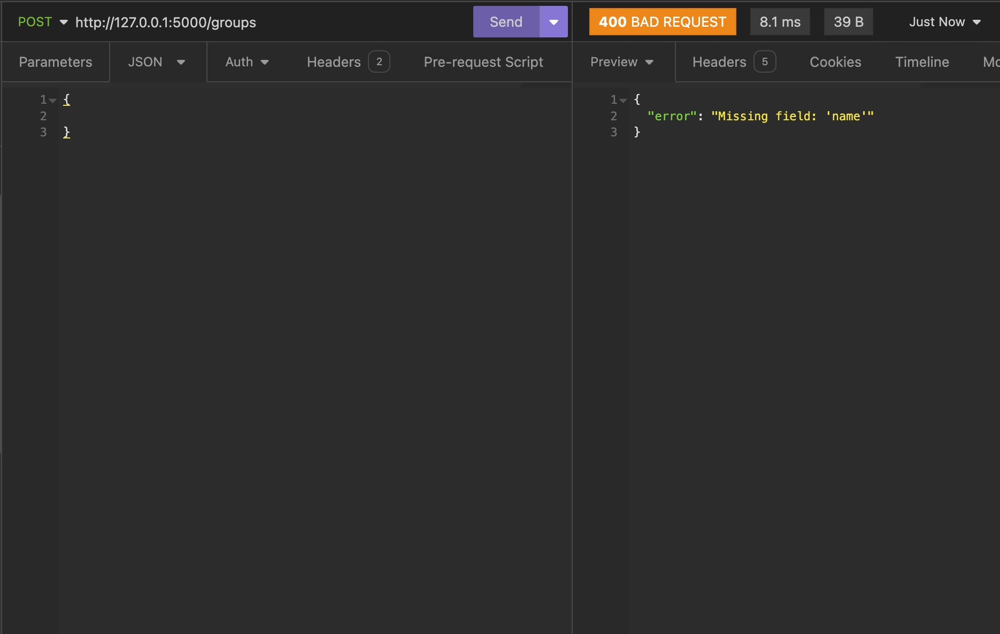
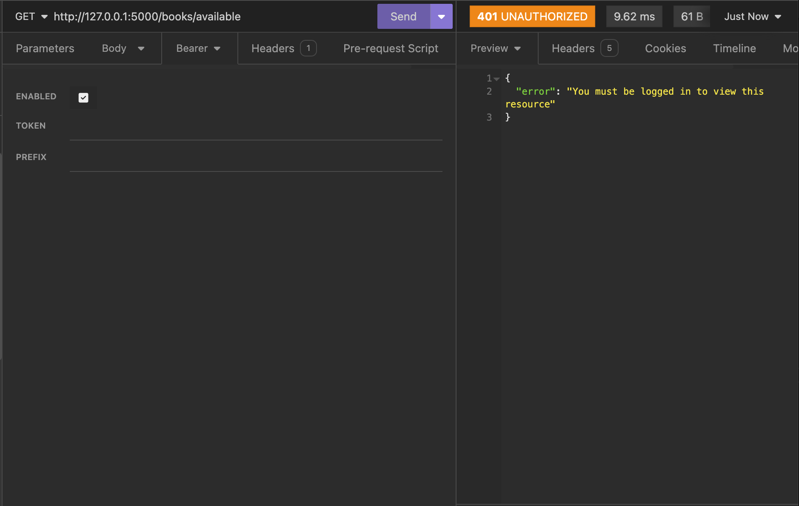

# XanthiaMason_T2A2

## GitHub Repository
The link to the GitHub repository for this project can be found [here](https://github.com/xanni99/XanthiaMason_T2A2).

## R1: Problems the App Solves

The app being developed is a ‘Friend Library’ that will allow friends and/or family to make their own library where they can each add all of the books that they own (and are willing to share) and allow everyone else in the group to borrow their books and likewise allow them to borrow the books from other members of the group. In addition to this, it provides a space where books read by friends/family can be reviewed.

The development of this app aims to solve many problems that avid book lovers are currently facing, including difficulty tracking loans amongst friends/family, the cost of living crisis and underutilised book collections (sustainability)

Firstly, when friends or family borrow books, it is easy to lose track of who borrowed what and when, ultimately leading to lost or forgotten books. Additionally, friends that have borrowed a book may have forgotten who it came from, making it awkward for the lender to try and get the book back. The ‘Friend Library’ will provide a structured way to manage the lending and borrowing of books amongst friends/family. Users can request to borrow a book through the app, and the system keeps track of who has borrowed which book and for how long. Users can request how long they would like to borrow the book for, and be given a due date for when the book needs to be returned. Ultimately the app will help ensure borrowed books are returned to the user who owns the book in a timely manner. 

Secondly, the cost of living crisis has meant that “40% of Australian households have struggled to afford household basics in the last three months, and over half of Australians say they will struggle to pay an essential bill over the next three months” (The Salvation Army Australia, 2023). As a result, the cost of living crisis reduces disposable income, making it harder for people to purchase new books. ‘The Friend Library’ provides a cost-effective solution for a group of friends to access a wide range of books, promoting reading and literacy even during economically challenging times. 

Finally, sustainability is a crucial consideration in today's world, particularly regarding the production and consumption of goods. A study by the Pew Research Center found that while the average American reads 12 books per year, a significant portion of personal book collections remain underutilised after initial reading (Perrin, 2016). The ‘Friend Library’ app addresses sustainability concerns by promoting the sharing of books, reducing the need for new purchases, and ultimately minimising environmental impact.

## R2: Allocation and Tracking of Tasks

Throughout the length of this project, Trello was used as a project management tool in order to help me allocate and keep track of the tasks required. For this project, I ordered my Trello board into 4 lists, and used labels and due dates to identify the importance/priority of each card.

The colour key for the labels can be found below:


**Initial Trello Board:**


Firstly, I had a Project ‘Overview’ List, which broke the project down into the 6 broad steps that had to be taken in order to submit a complete assignment. By doing this, I was able to establish a timeline using the ‘due date’ feature provided by Trello which gave me an idea of when each step should be completed by. I chose to implement the due dates on the broader steps rather than giving each and every task a due date as not only was this more time efficient, I was unsure of how long each little card (within the other lists) would take.

The other 3 lists included a more specific breakdown tasks. For more complex tasks I further broke these down through the use of Trello’s ‘Checklist’ feature which allowed me to create more manageable mini tasks. Ultimately, this allowed me to more specifically keep track of what task I was up to. Although the majority of these cards/tasks were planned at the beginning of the project, some additional cards and/or checklist items were added as a greater understanding of the project requirements became clear.

An example of a card with a checklist can be seen below:


Below are a few progress screenshots throughout the length of the project. The full history of the Trello board can be accessed using this [link](https://trello.com/invite/b/9WrdjPWe/ATTIcecca4744731527ce26eaddc016749955A1825ED/t2a2-api-webserver).

**Trello Board at Halfway (22/06/24):**


**Trello Board at End of Project (27/06/24):**


In addition to using Trello for overall project management, GitHub was utilised for version control and code management. With over 40 commits, GitHub provided an efficient way to store, track and manage changes to the code throughout the project.

## R3: Third-Party Services, Packages and Dependencies

| **Packages**     | **Description** |
| ------------ | ------------------------------------------ |
| Flask        | **Flask** is a micro web framework written in python. Flask serves as the core framework of the application, handling routing, request processing, and responses. It provides the essential tools needed to build web applications and APIs.|
|| **Flask-JWT-Extended**: This is an extension for Flask that simplifies the integration of JSON Web Tokens (JWT) for authentication and authorization.This extension manages the creation, handling, and verification of JWTs. It helps secure the application by ensuring that only authenticated users can access certain endpoints.
| PostgreSQL   | **PostgreSQL** is an open-source, powerful, and highly extensible relational database management system (RDBMS). PostgreSQL serves as the database backend for the application, storing all persistent data including user information, application state, and other critical data. |
| SQLAlchemy   | **SQLAlchemy** is a SQL toolkit and Object-Relational Mapping (ORM) library for Python. SQLAlchemy facilitates interaction with the PostgreSQL database by providing a high-level ORM to manage database models and queries, enabling interaction with the database using Python classes and objects. |
| Psycopg2     | **Psycopg2** is a PostgreSQL adapter for Python. Psycopg2 provides the interface to connect the Flask application to the PostgreSQL database, allowing SQLAlchemy to execute SQL queries and transactions on the PostgreSQL server. |
| Marshmallow  | **Marshmallow** is an ORM/ODM/framework-agnostic library for object serialisation/deserialization and validation. Marshmallow is used to serialise (convert objects to JSON) and deserialize (convert JSON to objects) data, and to validate the data before it's processed or stored in the database. |
| Bcrypt        |**Bcrypt** is a library for hashing and verifying passwords using the bcrypt hashing algorithm. Bcrypt is used within the app to securely hash passwords before storing them in the database and to verify entered passwords during authentication. Hashing passwords helps protect user data in case of a database breach. |

**Dependencies**


## R4: Benefits and Drawbacks of the App’s Database System

The database system used for this project was PostgreSQL. PostgreSQL is “a powerful, open source object-relational database system that uses and extends the SQL language combined with many features that safely store and scale the most complicated data workloads” (PostgreSQL, 2019). With more than 35 years of active development, PostgreSQL is known for its proven “architecture, reliability, data integrity, robust feature set and extensibility” (PostgreSQL, 2019). As a result, PostgreSQL has increasingly become the open source relational database of choice for a large majority of the community.

PostgreSQL comes with many benefits that has attracted a large community of users. Firstly, PostgreSQL source code is available under an open-source licence, allowing users to use, modify and implement code at no charge (Amazon Web Services, n.d.). Being no-cost ultimately poses huge economic benefits to not only individual users, but to larger companies as well. As a result of this, PostgreSQL has been able to foster a large dedicated community of contributors and enthusiasts. Furthermore, being open-source, this community regularly find bugs and fixes, which ultimately adds to the overall security of the database system (Amazon Web Services, n.d.).

Another benefit of PostgreSQL is its customizability and extensibility. PostgreSQL’s design allows users to add new custom data types, operators and functions to the database, ultimately expanding it’s capability. Additionally, it’s extensibility has proven to be useful in managing particular data types or developing domain-specific features (BrainerHub Solutions, 2023).

Furthermore, PostgreSQL has a variety of indexes including “B-tree, hash and generic search trees” (BrainerHub Solutions, 2023). These indexes ultimately improve query performance and provide practical data sorting and searching capabilities. In addition to this, PostgreSQL assists full-text search capabilities with stemming, ranking and phrase-searching support (BrainerHub Solutions, 2023).

Finally, PostgreSQL is a highly fault tolerant and ACID-compliant database (Amazon Web Services, n.d.). ACID refers to atomicity, consistency, isolation and durability - four key characteristics that make database transactions reliable (Amazon Web Services, n.d.). Being ACID-compliant indicates that data in a database is accurate as incomplete changes are never stored. Features of PostgreSQL such as logging, Multi-Version Concurrency Control, and point-in-time recovery make ACID compliance possible (Amazon Web Services, n.d.).

While it is clear that there are numerous benefits to using PostgreSQL as a database, it is inevitable that there are also some drawbacks. Firstly, PostgreSQL is an open source database application, which is not owned by one particular organisation. While this is mostly seen as a benefit for reasons listed earlier, it also means that there is no single point of contact for support, nor does it come with warranty, liability or indemnity protection (Dhruv, 2019). In addition to this, being open source and managed by multiple members of the community, it can lack uniformity across it’s interfaces and features, ultimately impacting its coherence and comprehensiveness (Dhruv, 2019).

Another drawback of PostgreSQL is that it can have slow performance. Due to its relational database structure, when finding a query, PostgreSQL has to begin with the first row and then read through the entire table to find relevant data. As a result it can perform particularly slow when there is a large amount of data stored in the rows and columns, containing many fields and information to compare (Dhruv, 2019).

## R5: Object-Relational Mapping in the App

The object-relational mapping (ORM) system used in this app was SQLAlchemy. SQLAlchemy is an ORM library for Python, which means it facilitates the management and interaction between Python objects and relational databases. Ultimately it allows for interaction with the database using Python code instead of writing raw SQL queries, which enhances code readability, maintainability, and modularity. There are many features and functionalities that SQLAlchemy provides that allowed for the creation of this application.

Firstly, **‘Declarative Mapping’** is a technique where classes are mapped to database tables using Python classes and SQLAlchemy’s declarative_base class. This approach makes it easy to define database schemas and their relationships in an object-oriented manner.

Secondly, SQLAlchemy’s **Session Management** allows a session to be created, which serves as a workspace for all the operations you perform on your database objects. It allows you to add, update, delete, and query objects, and then commit the changes to the database. For example, in the code block below, a new book is added to the database, and the changes are committed using the session object.


Thirdly, utilising SQLAlchemy ORM allows for complex **queries** using the session object and various filtering options. The query method is used to retrieve an instance of a book from the database using SQLAlchemy’s querying capabilities. In this particular example, these capabilities allow for a more specific query that joins the User table and filters by user_group_id and book_id.


In addition to this, SQLAlchemy supports various types of **relationships** between tables, such as one-to-many, many-to-one, and many-to-many. These relationships are managed using foreign keys and the relationship function. This can be seen in the code block below for the class ‘Book’. It can be seen that it has a relationship with ‘User’, ‘Loan’ and ‘Review’’.


Finally, SQLAlchemy ORM provides mechanisms to enforce **data validation** and integrity. Constraints such as unique, nullable, and foreign key constraints ensure the integrity of the data. For example, it can be seen in the code block above for the class ‘Book’ that it has a Foreign Key constraint ‘user_id’ populated from the ‘Users’ table.

## R6: Entity Relationship Diagram


**Crow's Foot Notation Key**:


**Relationsip Table**:
| Entity One | Relationship | Entity Two | Description |
| :--------: | :----------: | :--------: | :----------:|
| Groups | One (required) to none or many | Users | One Group can have none to many Users|
| Users | One (required) to none or many | Books | One user can be the **owner of** none to many Books |
| Users | Many to Many | Books | A User can **borrow** many Books and a Book can be **borrowed** by many Users - managed through **Loans table** |
| Users | One (required) to none or many | Loans | One User can have none to many Loans|
| Users | One (required) to none or many | Reviews | One User can have none to many Reviews|
| Books | One (required) to none or many | Loans | One Book can have none to many Loans|
| Books | One (required) to none or many | Reviews | One Book can have none to many Reviews|

The Entity Relationship Diagram (ERD) modelling this application’s database, was created using **Crow’s Foot Notation**. As can be seen in the diagram above (and more clearly laid out in the relationships table), the relations between the diagrammed models are all ‘One to (None or) Many’ Relationships. It can also be seen from the relationships table that there is a ‘Many to Many’ relationship between Users and the **borrowing of** Books, as a User can **borrow** many Books and a Book can be **borrowed** by many Users. However, in the ERD this ‘Many to Many’ relationship is managed through the Loans table which acts as a junction table between Users and Books.

As can be seen from the ERD above, all the tables (Users, Books, Loans, Reviews, and Groups) are in Third Normal Form (3NF). Each table has no partial or transitive dependencies, ensuring data integrity and reducing redundancy. If each model was not in 3NF, some tables may be combined in order to reduce the complexity of queries. For example in First Normal Form (1NF), the books and loans table could be combined (see figure below), however this would introduce redundancy as a single book can have multiple loan records over time. As a result, ‘user_id’, ‘Loan_date’ and ‘Due_date’ would be repeated for each loan record, increasing data redundancy.


By ensuring that all of the tables are in 3NF and all relationships are modelled correctly, it will ensure referential integrity, reduce data redundancy, allow for scalability, and allow for efficient querying. Ultimately, the above ERD provides a robust structure that supports the application's functionality,ensuring a foundation for efficient data management and operations.

## R7: Implemented Models and their Relationships

**GROUPS:**

The Groups model represents a group within the application. The Groups model only has one relationship:


Groups have a **One to (None or) Many** relationship with Users, as one group can have none or many users and users can only belong to one group. Each User belongs to a particular Group and only the user’s friends/family that they give the code to will be in their group. In order to allow for this, ‘group_id’ is a foreign key in Users. This allows multiple different friend/family groups to use the one application and only see corresponding data that is relevant to them.

**Example Query using Relationship:**
```SQL
SELECT * FROM Users WHERE group_id = ?;
```

**USERS:**

The Users model represents a user within the application. The Users model has four relationships:


As stated above, Users have a **(None or) Many to One** relationship with Groups, as None or Many Users can belong to One Group and a Group can have none or many users. 

Users have a **One to (None or) Many** relationship with Books, as One User can be the owner of none or many books and a book can only belong to one user. Each user can add none to many books that they are willing to share with other users in their group. By having this relationship (and ‘user_id’ as a foreign key in Book) it allows multiple books that belong to one user to be tracked and grouped together.

**Example Query using Relationship:**

```SQL
SELECT * FROM Books WHERE user_id = ?;
```

Users have a One to (None or) Many relationship with Loans, as One User can have none or many loans and a loan can only belong to one user. By having this relationship (and ‘user_id’ as a foreign key in Loans) it allows loans by a particular user to be made and tracked.

**Example Query using Relationship:**

```SQL
SELECT * FROM Loans WHERE user_id = ?;
```

Users have a One to (None or) Many relationship with Reviews, as One User can make none or many reviews and a review can only belong to one user. By having this relationship (and ‘user_id’ as a foreign key in Reviews) it allows reviews by a particular user to be made and tracked.

**Example Query using Relationship:**

```SQL
SELECT * FROM Reviews WHERE user_id = ?;
```

**BOOKS:**

The Books model represents a book within the application. The Books model has three relationships:


As stated above, Books have a **(None or) Many to One** relationship with Users, as None or Many Books can belong to One User and a User can have none or many Books.

Books have a **One to (None or) Many** relationship with Loans, as One Book can have none or many loans and a Loan can only have one Book. By having this relationship (and ‘book_id’ as a foreign key in Loans) it allows loans for a particular book to be made and tracked.

**Example Query using Relationship:**

```SQL
SELECT * FROM Loans WHERE book_id = ?;
```

Books have a **One to (None or) Many** relationship with Reviews, as One Book can have none or many reviews and a Review can only have one Book. By having this relationship (and ‘book_id’ as a foreign key in Reviews) it allows reviews for a particular book to be made and tracked.

**Example Query using Relationship:**

```SQL
SELECT * FROM Reviews WHERE book_id = ?;
```

**LOANS:**

The Loans model represents a loan within the application and is a join table for Users and Books as they have a many to many relationship when it comes to borrowing (loaning) books. As a result, the Loans model has two relationships:


As stated above, **Loans have a (None or) Many to One** relationship with Books, as None or Many Loans can belong to One Book and a Book can have none or many Loans.

Also stated above, **Loans have a (None or) Many to One** relationship with Users, as None or Many Loans can belong to One User and a User can have none or many Loans.

By having this join table that has ‘book_id’ and ‘user_id’ as foreign keys, it allows particular books to be loaned by a particular user and this information to be tracked.

**REVIEWS:**

The Reviews model represents a review made within the application. The Reviews model has two relationships:


As stated above, Reviews have a **(None or) Many to One** relationship with Users, as None or Many Reviews can belong to One User and a User can have none or many Reviews.

Also stated above, Reviews have a **(None or) Many** to One relationship with Books, as None or Many Reviews can belong to One Book and a Book can have none or many Reviews.

**Overall**, the above relationships aid in the implementation of a robust database. The foreign key constraints ensure that references between tables remain valid, preventing orphan records and maintaining referential integrity. In addition to this, the model’s relationships can be used to access more complex data as seen in the examples above.

A more complex example using multiple relationships and foreign keys, would be if a user wanted to retrieve a list of available books. Although it seems simple, in order to retrieve available books within the user’s group only, the Groups-User relationship and the Users-Books relationship will need to be utilised. The Groups-Users Relationship is key throughout the use of this app. This relationship allows data to be returned that is only relevant to the group of the particular user. In this example it allows only books available within the user’s group to be returned rather than all of the available books within the entire database which may belong to user’s from other groups (that are not the user’s friends or family and therefore would not be able to borrow the book in real life). A query that will return this data can be seen below:

```SQL
SELECT * FROM Books 
JOIN Users ON Books.user_id = Users.id 
WHERE Books.is_available = TRUE 
AND Users.group_id = :user_group_id;
```

## R8: API Endpoints

### 1. Create a Group (C)

**Verb:** “POST”

**Path:** /groups/

**Required Data:**

- **Header Data:** Not Required
- **Bearer Token Required:** Not Required
- **Body Data:** "name"

**Response:** Response returned after creating a group is the group “id” and group “name”.

**Errors:** An error will occur if a group name is not provided

**Successful Example:**


**Failure Example:**



### 2. Create a User (C)

**Verb:** "POST"

**Path:** /users/

**Required Data:**

- **Header Data:** Not Required
- **Bearer Token Required:** Not Required
- **Body Data:**
    - “name”
    - “email” (must be unique)
    - “password” (must be at least 8 characters long)
    - “group_id”
    - “is_admin” (must be a boolean - True or False)

**Response:** Response returned after creating a user is the user “name” and user “email”.

**Errors:** An error will occur if:
- any required fields are not included, 
- the email entered already exists in the database, 
- the password given is less than 8 characters,
- the group id does not exist in the database.

**Successful Example:**


**Failure Example:**


### 3. User Login (C)

**Verb:** "POST"

**Path:** /users/login/

**Required Data:**

- **Header Data:** Not Required
- **Bearer Token Required:** Not Required
- **Body Data:**
    - "email"
    - "password" (must be at least 8 characters)

**Response:** Response returned after successfully logging in is the user’s JWT token

**Errors:** An error will occur if:
- any required fields are not included, 
- the email entered does not exist in the database,
- the password given is less than 8 characters,
- the password entered does not exist in the database

**Successful Example:**


**Failure Example:**


### 4. Get All Users (R)

**Verb:** “GET”

**Path:** /users/

**Required Data:**

- **Header Data:** Not Required
- **Bearer Token Required:** Yes - user or admin
- **Body Data:** Not Required

**Response:** Response returned after getting all users is the user “id” and user “name” of all users within the same group of the current user.

**Errors:** An error will occur if:
- No or an invalid JWT token is provided

**Successful Example:**


**Failure Example:**


### 5. Update a User (U)

**Verb:** “PUT” or “PATCH”

**Path:** /users/update/<user.id>

**Required Data:**

- **Header Data:** User_id of user intending to be updated
- **Bearer Token Required:** Yes - user of account being updated
- **Body Data:** Fields wanting to be updated

**Response:** Response returned after successfully updating user details is “Details Successfully Updated”

**Errors:** An error will occur if:
- No id is provided in path
- No or non current user JWT token is provided

**Successful Example:**


**Failure Example:**


### 6. Delete User (D)

**Verb:** “DELETE”

**Path:** /users/delete/<user.id>

**Required Data:**

- **Header Data:** User_id of user intending to be deleted
- **Bearer Token Required:** Yes - user of account being deleted OR admin
- **Body Data:** Not required

**Response:** Response returned after successfully deleting a user is “User deleted”

**Errors:** An error will occur if:
- No id is provided in path
- No, non-admin or non current user JWT token is provided

**Successful Example:**


**Failure Example:**


### 7. Add a Book (C)

**Verb:** “POST”

**Path:** /books/

**Required Data:**

- **Header Data:** Not Required
- **Bearer Token Required:** Yes (Admin or User)
- **Body Data:** 
    - “title”
    - “author”
    - “genre”
    - “description”
    - “is_available”

**Response:** Response returned after successfully adding a book is a dictionary of the new book details + the user who added it.

**Errors:** An error will occur if:
- An expired or no JWT token is provided
- Not all fields are provided (required to add a book)

**Successful Example:**


**Failure Example:**


### 8. View All Books (R)

**Verb:** “GET”

**Path:** /books/

**Required Data:**

- **Header Data:** Not Required
- **Bearer Token Required:** Yes (user or admin)
- **Body Data:** Not Required

**Response:** Response returned after successfully viewing all books, is list of all book dictionaries within the current user’s group.

**Errors:** An error will occur if:
- An expired or no JWT token is provided

**Successful Example:**


**Failure Example:**


### 9. View a Book (R)

**Verb:** “GET”

**Path:** /books/<book.id>

**Required Data:**

- **Header Data:** id of book intending to be viewed
- **Bearer Token Required:** Yes (user or admin)
- **Body Data:** Not Required

**Response:** Response returned after successfully viewing a book is, “author”, “title”, “description”, “genre”, “is_available”, “reviews”.

**Errors:** An error will occur if:
- An expired or no JWT token is provided
- The book.id given does not exist in the database

**Successful Example:**


**Failure Example:**


### 10. View All Available Books (R)

**Verb:** “GET”

**Path:** /books/available

**Required Data:**

- **Header Data:** Not Required
- **Bearer Token Required:** Yes (user or admin)
- **Body Data:** Not Required

**Response:** Response returned after successfully viewing all available books, is list of all books within the current user’s group that have an “is_available” status = True.

**Errors:** An error will occur if:
- An expired or no JWT token is provided

**Successful Example:**


**Failure Example:**



### 11. Update a Book (U)

**Verb:** “PUT” or “PATCH”

**Path:** /books/update/<book.id>

**Required Data:**

- **Header Data:** id of book intending to be updated
- **Bearer Token Required:** Yes- has to be user that owns book
- **Body Data:** Fields wanting to be updated

**Response:** Response returned after successfully updating a book is the instance of the updated book with it’s updated fields

**Errors:** An error will occur if:
- An expired or no JWT token is provided
- The user attempting to update the book is not the owner of the book

**Successful Example:**


**Failure Example:**


### 12. Delete a Book (D)

**Verb:** “DELETE”

**Path:** /books/delete/<book.id>

**Required Data:**

- **Header Data:** id of book intending to be updated
- **Bearer Token Required:** Yes - owner of book OR admin
- **Body Data:** Not Required

**Response:** Response returned after successfully deleting a book is “book deleted”

**Errors:** An error will occur if:
- An expired or no JWT token is provided
- The user attempting to delete the book is not the owner of the book or an admin
- The id of the book does not exist in the database

**Successful Example:**


**Failure Example:**


### 13. Borrow a Book (C)

**Verb:** “POST”

**Path:** /loans/borrow/<book.id>

**Required Data:**

- **Header Data:** id of book intending to be borrowed
- **Bearer Token Required:** Yes (user or admin)
- **Body Data:** “borrow_length” (must be between 1 and 21)

**Response:** Response returned after successfully borrowing a book is the book “title”, “borrow_length”, “borrow_date”, “due_date”, loan “id”, returned_date” and “name” of user who made the loan.

**Errors:** An error will occur if:
- An expired or no JWT token is provided
- The id of the book does not exist in the database 
- The id of the book is not within the user’s group
- The book requested “is_available” status = False
- A borrow length is not given

**Successful Example:**


**Failure Example:**


### 14. View Own User Loans (R)

**Verb:** “GET”

**Path:** /loans/

**Required Data:**

- **Header Data:** Not Required
- **Bearer Token Required:** Yes - user intending to see their loan history
- **Body Data:** Not Required

**Response:** Response returned after successfully viewing own user loans is the book “title”, “borrow_length”, “borrow_date”, “due_date”, loan “id”, returned_date” and “name” of user who made the loan, for each book loaned by the user.

If the user has not yet made any loans  a corresponding message will appear instead.

**Errors:** An error will occur if:
- An expired or no JWT token is provided

**Successful Example:**


**Failure Example:**


### 15. View Entire Loan History (R)

**Verb:** “GET”

**Path:** /loans/

**Required Data:**

- **Header Data:** Not Required
- **Bearer Token Required:** Yes - must be admin
- **Body Data:** Not Required

**Response:** Response returned after successfully viewing all user loans is all of the loan fields for each loan made for every user in the group.

**Errors:** An error will occur if:
- An expired or no JWT token is provided
- The user trying to access this resource is not an admin

**Successful Example:**


**Failure Example:**


### 16. Return a Book (U)

**Verb:** “PATCH”

**Path:** /loans/return/<loan.id>

**Required Data:**

- **Header Data:** id of loan created when borrowing the book
- **Bearer Token Required:** Yes, user who made the loan (borrowed the book)
- **Body Data:** Not Required

**Response:** Response returned after successfully borrowing a book is the book “title”, “borrow_length”, “borrow_date”, “due_date”, loan “id”, returned_date” and “name” of user who made the loan.

**Errors:** An error will occur if:
- An expired or no JWT token is provided
- The user trying to return the book was not the user who borrowed it

**Successful Example:**


**Failure Example:**


### 17. Review a Book (C)

**Verb:** “POST”

**Path:** /reviews/add/<book.id>

**Required Data:**

- **Header Data:** id of book wanting to be reviewed
- **Bearer Token Required:** Yes (User or Admin)
- **Body Data:**
    - “rating” (must be between 1 and 5)
    - “review”

**Response:** Response returned after successfully reviewing a book is the “title” of the book and the “rating” and “review” given.

**Errors:** An error will occur if:
- An expired or no JWT token is provided
- The book.id does not exist in the database within the user’s group

**Successful Example:**


**Failure Example:**


### 18. View all Reviews (R)

**Verb:** “GET”

**Path:** /reviews/

**Required Data:**

- **Header Data:** Not Required
- **Bearer Token Required:** Yes (User or Admin)
- **Body Data:** Not Required

**Response:** Response returned after successfully viewing all reviews is the book “title” and “author”, “date” review was made, “rating”, “review” and the “user” who left the review for all reviews made on books within the current user’s group.

If no reviews exist within the database, a corresponding message will be shown instead.

**Errors:** An error will occur if:
- An expired or no JWT token is provided

**Successful Example:**


**Failure Example:**


### 19. View Reviews for a Book (R)

**Verb:** “GET”

**Path:** /reviews/<book.id>

**Required Data:**

- **Header Data:** id of book user is wanting to see reviews for
- **Bearer Token Required:** Yes (User or Admin)
- **Body Data:** Not Required

**Response:** Response returned after successfully viewing all reviews is the “date” review was made, “rating”, “review” and the “user” who left the review for all reviews made on book specified by id, within the current user’s group.

If no reviews exist within the database, a corresponding message will be shown instead.

**Errors:** An error will occur if:
- An expired or no JWT token is provided
- book.id given does not exist in the database within the current user’s group

**Successful Example:**


**Failure Example:**


### 20. Update a Book Review (U)

**Verb:** “PUT” or “PATCH”

**Path:** reviews/update/<review.id>

**Required Data:**

- **Header Data:** id of review intending to be updated
- **Bearer Token Required:** Yes - had to be the user that made the review
- **Body Data:** Fields wanting to be updated

**Response:** Response returned after successfully updating a review is all of the review fields displaying updated fields

**Errors:** An error will occur if:
- An expired or no JWT token is provided
- The user wanting to update the review did not make the review
- review.id given does not exist in the database within the current user’s group

**Successful Example:**


**Failure Example:**


### 21. Delete a Book Review (D)

**Verb:** “DELETE”

**Path:** reviews/delete/<review.id>

**Required Data:**

- **Header Data:** id of review intending to be deleted
- **Bearer Token Required:** Yes - user that made the review OR Admin
- **Body Data:** Not required

**Response:** Response returned after successfully deleting a book is “Review deleted”

**Errors:** An error will occur if:
- An expired or no JWT token is provided
- The user wanting to delete the review did not make the review or is not an admin
- review.id given does not exist in the database within the current user’s group

**Successful Example:**


**Failure Example:**


## References

Amazon Web Services (n.d.). What is PostgreSQL? [online] Amazon Web Services. Available at: https://aws.amazon.com/rds/postgresql/what-is-postgresql/.

BrainerHub Solutions (2023). PostgreSQL: A Practical Guide—Features and Advantages. [online] www.linkedin.com. Available at: https://www.linkedin.com/pulse/postgresql-practical-guidefeatures-advantages-brainerhub-solutions/.

Dhruv, S. (2019). Pros and Cons of using PostgreSQL for Application Development. [online] Aalpha. Available at: https://www.aalpha.net/blog/pros-and-cons-of-using-postgresql-for-application-development/.

Perrin, A. (2016). Book Reading 2016. [online] Pew Research Center: Internet, Science & Tech. Available at: https://www.pewresearch.org/internet/2016/09/01/book-reading-2016/.

PostgreSQL (2019). PostgreSQL: About. [online] Postgresql.org. Available at: https://www.postgresql.org/about/.

The Salvation Army Australia (2023). Cost of Living Crisis Australia | The Salvation Army Australia. [online] www.salvationarmy.org.au. Available at: https://www.salvationarmy.org.au/red-shield-appeal/the-cost-of-living-crisis-in-australia/.